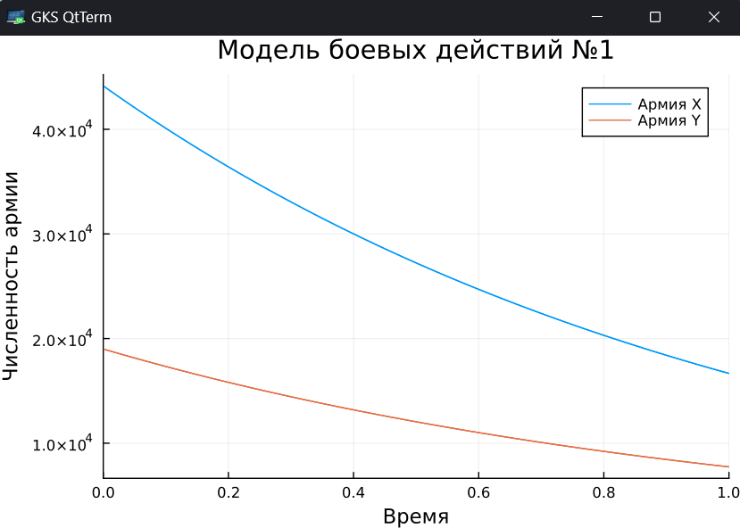
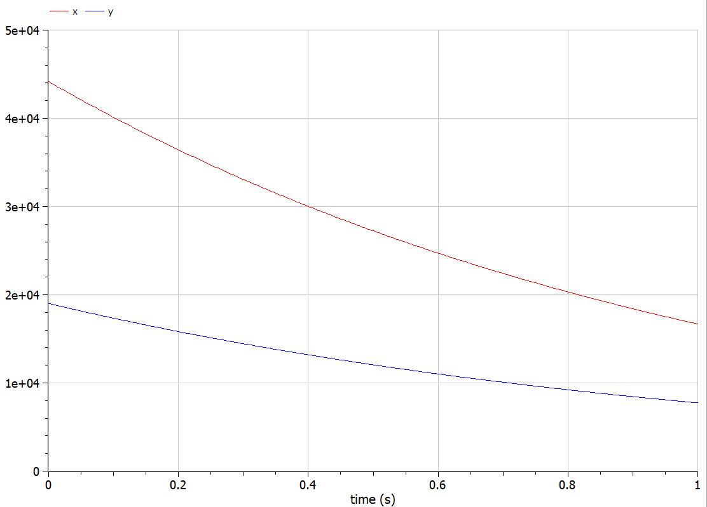
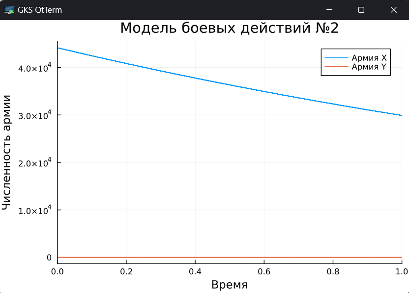
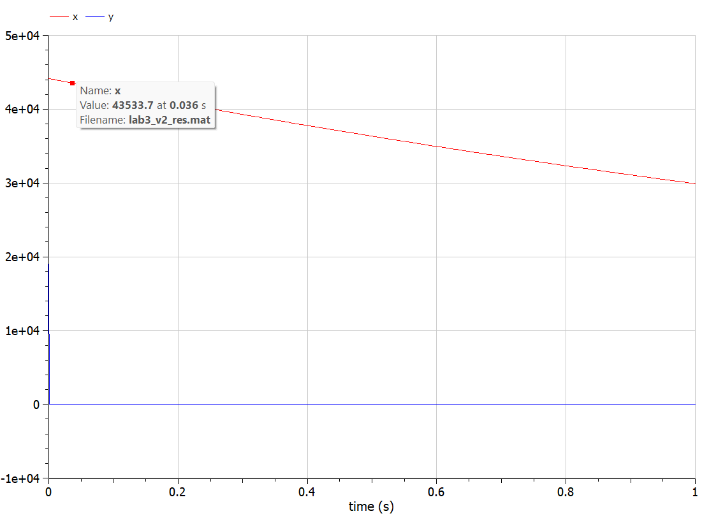

---
## Front matter
lang: ru-RU
title: Лабораторная работа №3
subtitle: Модель боевых действий
author:
  - Замбалова Дина Владимировна
institute:
  - Российский университет дружбы народов, Москва, Россия

## i18n babel
babel-lang: russian
babel-otherlangs: english

## Formatting pdf
toc: false
toc-title: Содержание
slide_level: 2
aspectratio: 169
section-titles: true
theme: metropolis
header-includes:
 - \metroset{progressbar=frametitle,sectionpage=progressbar,numbering=fraction}
 - '\makeatletter'
 - '\beamer@ignorenonframefalse'
 - '\makeatother'
---

# Информация

## Докладчик

:::::::::::::: {.columns align=center}
::: {.column width="70%"}

  * Замбалова Дина Владимировна
  * студентка
  * Российский университет дружбы народов
  * [1132226536@pfur.ru](mailto:1032216453@pfur.ru)
  * <https://github.com/dvzambalova>

:::
::: {.column width="25%"}

:::
::::::::::::::

## Цель работы

Построить модель боевых действий на языке прогаммирования Julia и посредством ПО OpenModelica.

## Задание

Построить графики изменения численности войск армии $X$ и армии $Y$ для  следующих случаев:

1. Модель боевых действий между регулярными войсками

2. Модель ведение боевых действий с участием регулярных войск и партизанских отрядов

# Выполнение лабораторной работы

## Модель боевых действий между регулярными войсками

$$\begin{cases}
    \dfrac{dx}{dt} = -0.57x(t)- 0.91y(t)+sin(5t)+1\\
    \dfrac{dy}{dt} = -0.31x(t)- 0.2y(t)+cos(3t)+2
\end{cases}$$

## Модель боевых действий между регулярными войсками

```Julia
function reg(u, p, t)
    x, y = u
    a, b, c, h = p
    dx = -a*x - b*y+sin(5*t)+1
    dy = -c*x -h*y+cos(3*t)+2
    return [dx, dy]
end
```
## Модель боевых действий между регулярными войсками

```Julia
# начальные условия
u0 = [44150, 19000]
p = [0.57, 0.91, 0.31, 0.2]
tspan = (0,1)
```

## Модель боевых действий между регулярными войсками

```Julia
prob = ODEProblem(reg, u0, tspan, p)
sol = solve(prob, Tsit5())
plot(sol)
```

## Модель боевых действий между регулярными войсками

{#fig:001 width=70%}

## Модель боевых действий между регулярными войсками

```OpenModelica
model lab3
  parameter Real a = 0.57;
  parameter Real b = 0.91;
  parameter Real c = 0.31;
  parameter Real h = 0.2;
  parameter Real x0 = 44150;
  parameter Real y0 = 19000;
  Real x(start=x0);
  Real y(start=y0);
equation
  der(x) = -a*x - b*y+sin(5*time)+1;
  der(y) = -c*x -h*y+cos(3*time)+2;
end lab3;
```

## Модель боевых действий между регулярными войсками

{#fig:002 width=70%}

## Модель ведение боевых действий с участием регулярных войск и партизанских отрядов

$$\begin{cases}
    \dfrac{dx}{dt} = -0.39x(t)-0.86y(t)+sin(2t)+1\\
    \dfrac{dy}{dt} = -0.39x(t)y(t)-0.21y(t)+cos(2t)+1
\end{cases}$$


## Модель ведение боевых действий с участием регулярных войск и партизанских отрядов

```Julia
function reg_part(u, p, t)
    x, y = u
    a, b, c, h = p
    dx = -a*x - b*y+sin(2*t)+1
    dy = -c*x*y -h*y+cos(2*t)+1
    return [dx, dy]
end
```

## Модель ведение боевых действий с участием регулярных войск и партизанских отрядов

```Julia
# начальные условия
u0 = [44150, 19000]
p = [0.39, 0.86, 0.39, 0.21]
tspan = (0,1)\
```

## Модель ведение боевых действий с участием регулярных войск и партизанских отрядов

```Julia
prob2 = ODEProblem(reg_part, u0, tspan, p)
sol2 = solve(prob2, Tsit5())
plot(sol2)
```

## Модель ведение боевых действий с участием регулярных войск и партизанских отрядов

{#fig:003 width=70%}


## Модель ведение боевых действий с участием регулярных войск и партизанских отрядов

```
model lab3_v2
  parameter Real a = 0.39;
  parameter Real b = 0.86;
  parameter Real c = 0.39;
  parameter Real h = 0.21;
  parameter Real x0 = 44150;
  parameter Real y0 = 19000;
  Real x(start=x0);
  Real y(start=y0);
equation
  der(x) = -a*x - b*y+sin(2*time)+1;
  der(y) = -c*x*y -h*y+cos(2*time)+1;
end lab3_v2;
```

## Модель ведение боевых действий с участием регулярных войск и партизанских отрядов

{#fig:004 width=70%}


## Выводы

В процессе выполнения данной лабораторной работы я построила модель боевых действий на языке прогаммирования Julia и посредством ПО OpenModelica, а также провела сравнительный анализ.

## Список литературы

1. Законы_Осипова_—_Ланчестера [Электронный ресурс]. URL: https://ru.wikipedia.org/wiki/Законы_Осипова_—_Ланчестера.