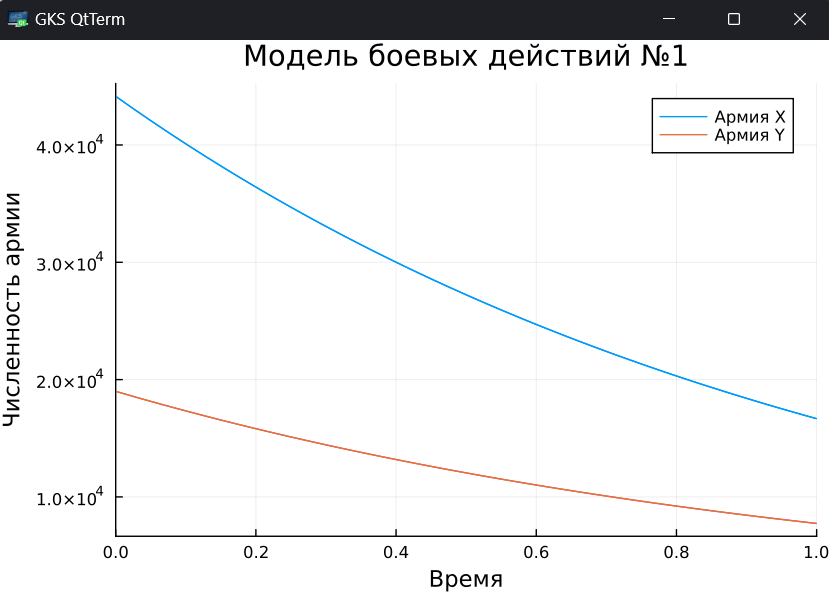
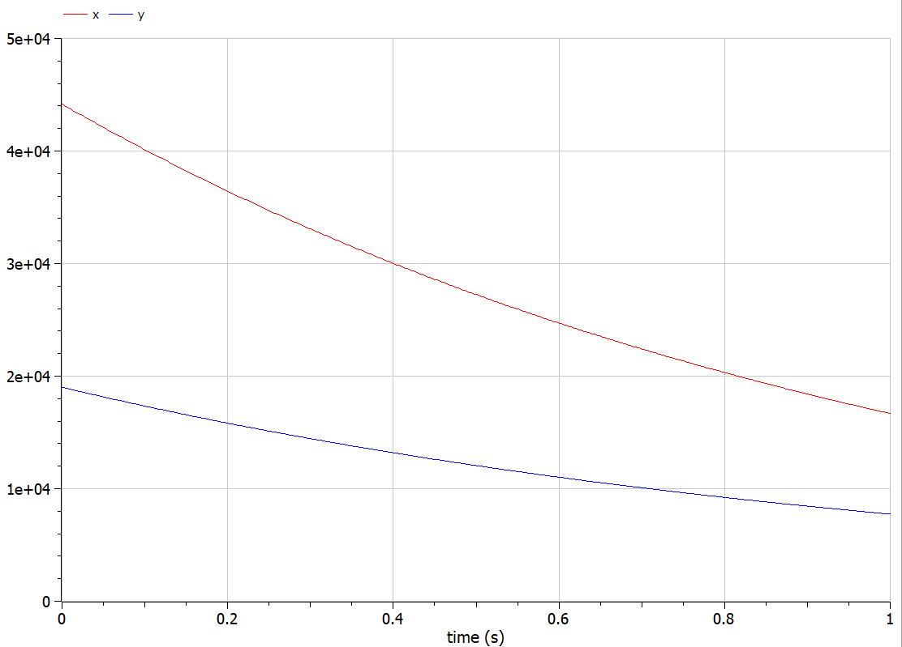
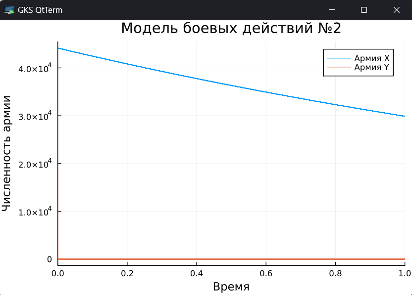
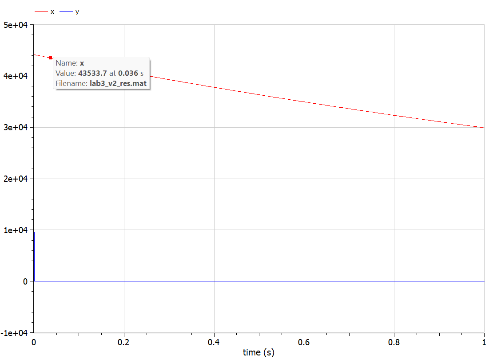

---
## Front matter
title: "Лабораторная работа № 3"
subtitle: "Модель боевых действий"
author: "Замбалова Дина Владимировна"

## Generic otions
lang: ru-RU
toc-title: "Содержание"

## Bibliography
bibliography: bib/cite.bib
csl: pandoc/csl/gost-r-7-0-5-2008-numeric.csl

## Pdf output format
toc: true # Table of contents
toc-depth: 2
lof: true # List of figures
lot: false # List of tables
fontsize: 12pt
linestretch: 1.5
papersize: a4
documentclass: scrreprt
## I18n polyglossia
polyglossia-lang:
  name: russian
  options:
	- spelling=modern
	- babelshorthands=true
polyglossia-otherlangs:
  name: english
## I18n babel
babel-lang: russian
babel-otherlangs: english
## Fonts
mainfont: PT Serif
romanfont: PT Serif
sansfont: PT Sans
monofont: PT Mono
mainfontoptions: Ligatures=TeX
romanfontoptions: Ligatures=TeX
sansfontoptions: Ligatures=TeX,Scale=MatchLowercase
monofontoptions: Scale=MatchLowercase,Scale=0.9
## Biblatex
biblatex: true
biblio-style: "gost-numeric"
biblatexoptions:
  - parentracker=true
  - backend=biber
  - hyperref=auto
  - language=auto
  - autolang=other*
  - citestyle=gost-numeric
## Pandoc-crossref LaTeX customization
figureTitle: "Рис."
tableTitle: "Таблица"
listingTitle: "Листинг"
lofTitle: "Список иллюстраций"
lotTitle: "Список таблиц"
lolTitle: "Листинги"
## Misc options
indent: true
header-includes:
  - \usepackage{indentfirst}
  - \usepackage{float} # keep figures where there are in the text
  - \floatplacement{figure}{H} # keep figures where there are in the text
---

# Цель работы

Построить модель боевых действий на языке прогаммирования Julia и посредством ПО OpenModelica.

# Задание

Между страной $X$ и страной $Y$ идет война. Численность состава войск
исчисляется от начала войны, и являются временными функциями $x(t)$ и $y(t)$. В
начальный момент времени страна $X$ имеет армию численностью 44 150 человек,
а в распоряжении страны $Y$ армия численностью в 19 000 человек. Для упрощения
модели считаем, что коэффициенты $a, b, c, h$ постоянны. Также считаем $P(t)$ и $Q(t)$ непрерывные функции.

Построить графики изменения численности войск армии $X$ и армии $Y$ для  следующих случаев:

1. Модель боевых действий между регулярными войсками
$$\begin{cases}
    \dfrac{dx}{dt} = -0.57x(t)- 0.91y(t)+sin(5t)+1\\
    \dfrac{dy}{dt} = -0.31x(t)- 0.2y(t)+cos(3t)+2
\end{cases}$$

2. Модель ведение боевых действий с участием регулярных войск и партизанских отрядов

$$\begin{cases}
    \dfrac{dx}{dt} = -0.39x(t)-0.86y(t)+sin(2t)+1\\
    \dfrac{dy}{dt} = -0.39x(t)y(t)-0.21y(t)+cos(2t)+1
\end{cases}$$

# Теоретическое введение

Законы Ланчестера (законы Осипова — Ланчестера) — математическая формула для расчета относительных сил пары сражающихся сторон — подразделений вооруженных сил. В статье «Влияние численности сражающихся сторон на их потери», опубликованной журналом «Военный сборник» в 1915 году, генерал-майор Корпуса военных топографов М. П. Осипов описал математическую модель глобального вооружённого противостояния, практически применяемую в военном деле при описании убыли сражающихся сторон с течением времени и, входящую в математическую теорию исследования операций, на год опередив английского математика Ф. У. Ланчестера. Мировая война, две революции в России не позволили новой власти заявить в установленном в научной среде порядке об открытии царского офицера.

Уравнения Ланчестера — это дифференциальные уравнения, описывающие зависимость между силами сражающихся сторон A и D как функцию от времени, причем функция зависит только от A и D.

В 1916 году, в разгар первой мировой войны, Фредерик Ланчестер разработал систему дифференциальных уравнений для демонстрации соотношения между противостоящими силами. Среди них есть так называемые Линейные законы Ланчестера (первого рода или честного боя, для рукопашного боя или неприцельного огня) и Квадратичные законы Ланчестера (для войн начиная с XX века с применением прицельного огня, дальнобойных орудий, огнестрельного оружия). В связи с установленным приоритетом в англоязычной литературе наметилась тенденция перехода от фразы «модель Ланчестера» к «модели Осипова — Ланчестера» [@wiki:bash].

# Выполнение лабораторной работы

## Модель боевых действий между регулярными войсками

$$\begin{cases}
    \dfrac{dx}{dt} = -0.57x(t)- 0.91y(t)+sin(5t)+1\\
    \dfrac{dy}{dt} = -0.31x(t)- 0.2y(t)+cos(3t)+2
\end{cases}$$

Потери, не связанные с боевыми действиями, описывают члены $-0.57x(t)$ и $-0.2y(t)$ (коэффиценты при $x$ и $y$ - это величины, характеризующие степень влияния различных факторов на потери), члены $-0.91y(t)$ и $-0.31x(t)$ отражают потери на поле боя (коэффиценты при  $x$ и $y$ указывают на эффективность боевых действий со стороны у и х соответственно). Функции P(t) = sin(5t)+1, Q(t) = cos(3t)+2 учитывают
возможность подхода подкрепления к войскам Х и У в течение одного дня.

Для начала построим эту модель на Julia:


```Julia

# используемые библиотеки
using DifferentialEquations, Plots;

# задание системы дифференциальных уравнений, описывающих модель 
# боевых действий между регулярными войсками
function reg(u, p, t)
    x, y = u
    a, b, c, h = p
    dx = -a*x - b*y+sin(5*t)+1
    dy = -c*x -h*y+cos(3*t)+2
    return [dx, dy]
end

# начальные условия
u0 = [44150, 19000]
p = [0.57, 0.91, 0.31, 0.2]
tspan = (0,1)

# постановка проблемы
prob = ODEProblem(reg, u0, tspan, p)

# решение системы ДУ
sol = solve(prob, Tsit5())

# построение графика, который описывает изменение численности армий
plot(sol, title = "Модель боевых действий №1",  label = ["Армия X" "Армия Y"], xaxis = "Время", yaxis = "Численность армии")
```

В результате получаем следующий график (рис. [-@fig:001]):

{#fig:001 width=70%}

Из графика видно, чтол выиграла армия страны  X, поскольку численность армии страны Y стала 0, а потом и вообще ушла в отрицательную часть графика. Потери страны X можно считать незначительными.

Теперь давайте построим эту же модель посредством OpenModelica.

Здесь модель строить еще проще. Мы просто задаем параметры, начальные условия, определяем систему уравнений и просим программу выполнить симуляцию этой модели.

```OpenModelica
model lab3
  parameter Real a = 0.57;
  parameter Real b = 0.91;
  parameter Real c = 0.31;
  parameter Real h = 0.2;
  parameter Real x0 = 44150;
  parameter Real y0 = 19000;
  Real x(start=x0);
  Real y(start=y0);
equation
  der(x) = -a*x - b*y+sin(5*time)+1;
  der(y) = -c*x -h*y+cos(3*time)+2;
end lab3;
```

В результате получаем слудющий график изменения численности армий (рис. [-@fig:002]):

{#fig:002 width=70%}

Здесь все также видно, что выиграла армия X.

Также заметим, что график, построенный на Julia, и график из OpenModelica ничем не отлоичаются. По крайней мере невооруженным глазом отличий не видно. 

## Модель ведение боевых действий с участием регулярных войск и партизанских отрядов

Во втором случае в борьбу добавляются партизанские отряды. Нерегулярные
войска в отличии от постоянной армии менее уязвимы, так как действуют скрытно,
в этом случае сопернику приходится действовать неизбирательно, по площадям,
занимаемым партизанами. Поэтому считается, что тем потерь партизан,
проводящих свои операции в разных местах на некоторой известной территории,
пропорционален не только численности армейских соединений, но и численности
самих партизан. В результате модель принимает вид:

$$\begin{cases}
    \dfrac{dx}{dt} = -0.39x(t)-0.86y(t)+sin(2t)+1\\
    \dfrac{dy}{dt} = -0.39x(t)y(t)-0.21y(t)+cos(2t)+1
\end{cases}$$

В этой системе все величины имею тот же смысл, что и в первой модели.

Построим модель на Julia:

```Julia

# задание системы дифференциальных уравнений, описывающих модель 
# боевых действий с участием регулярных войск и партизанских отрядов
function reg_part(u, p, t)
    x, y = u
    a, b, c, h = p
    dx = -a*x - b*y+sin(2*t)+1
    dy = -c*x*y -h*y+cos(2*t)+1
    return [dx, dy]
end

# начальные условия
u0 = [44150, 19000]
p = [0.39, 0.86, 0.39, 0.21]
tspan = (0,1)\

# постановка проблемы
prob2 = ODEProblem(reg_part, u0, tspan, p)

# решение системы ДУ
sol2 = solve(prob2, Tsit5())

# построение графика, который описывает изменение численности армий
plot(sol2, title = "Модель боевых действий №2", label = ["Армия X" "Армия Y"], xaxis = "Время", yaxis = "Численность армии")
```

В результате получаем слудющий график изменения численности армий (рис. [-@fig:003]):

{#fig:003 width=70%}

Здесь опять же выигрывает армия X, причем численность армии Y уменьшается до нуля практически моментально. Заметим также, что  даже после того как армия X победила (то есть численность армии Y стала равна 0), ее численность продолжает уменьшаться на заданном интервале (поскольку у нас есть коэффиценты, характеризующие степень влияния различных факторов на потери). 

Теперь выполним построение второй модели в Open Modelica. Код выглядит следующим образом:

```
model lab3_v2
  parameter Real a = 0.39;
  parameter Real b = 0.86;
  parameter Real c = 0.39;
  parameter Real h = 0.21;
  parameter Real x0 = 44150;
  parameter Real y0 = 19000;
  Real x(start=x0);
  Real y(start=y0);
equation
  der(x) = -a*x - b*y+sin(2*time)+1;
  der(y) = -c*x*y -h*y+cos(2*time)+1;
end lab3_v2;
```

В результате получается такой график:

{#fig:004 width=70%}

Из которого видно, что выиграла армия X, причем моментально, но тем не менее после победы ее численность продолжает уменьшаться.

Сравнивая графики, полученные в Julia и OpenModelica, разницы особой незаметно. Если сильно вглядываться, можно заметить, что в OpenModelica график чуть более плавный и точный.

# Выводы

В процессе выполнения данной лабораторной работы я построила модель боевых действий на языке прогаммирования Julia и посредством ПО OpenModelica, а также провела сравнительный анализ.

# Список литературы{.unnumbered}

::: {#refs}
:::