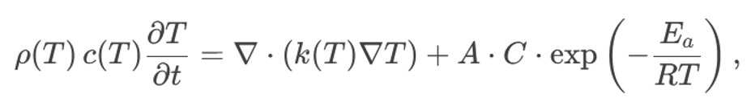

# Информация

## Докладчики

:::::::::::::: {.columns align=center}
::: {.column width="70%"}

  * Замбалова Дина Владимировна
  * Кузнецова София Вадимовна
  * Поляков Глеб Сергеевич
  * Скандарова Полина Юрьевна
  * Цвелёв Сергей Андреевич
  * Шулуужук Айраана Вячеславовна

:::
::: {.column width="25%"}

:::
::::::::::::::

# Цель работы

Проанализировать и сравнить численные алгоритмы, применяемые для моделирования теплопроводности при детерминированном горении, с целью оценки их эффективности, устойчивости и точности при решении задач с высокой нелинейностью и резкими градиентами температуры.

# Задание

1. Кратко описать математическую модель теплопроводности с источником тепла.
2. Выделить основные сложности моделирования: нелинейность, температурная зависимость, фронт горения.
3. Рассмотреть три численных алгоритма: МКР, МКЭ и метод подвижных сеток.
4. Проанализировать особенности реализации каждого метода.
5. Сравнить алгоритмы по точности, эффективности и применимости.
6. Дать рекомендации по выбору алгоритма для различных задач.

# Уравнение теплопроводности с источником тепла, граничные условия

Уравнение теплопроводности с источником тепла:

{width=70%}

- $ρ(T)$ - плотность материала, зависящая от температуры
- $c(T)$ - удельная теплоемкость, зависящая от температуры
- $T$ - температура
- $t$ - время
- $k(T)$ - коэффициент теплопроводности, зависящий от температуры
- $Q(T, C)$ - источник тепла, моделирующий процесс горения, зависящий от температуры и концентрации реагентов (C). 

# Уравнение теплопроводности с источником тепла, граничные условия

Часто представляется в виде аррениусовской зависимости:

{width=70%}

где $A$ - предэкспоненциальный фактор, $Ea$ - энергия активации, $R$ - универсальная газовая постоянная.

# Уравнение теплопроводности с источником тепла, граничные условия

Наиболее распространенные типы граничных условий:

Дирихле (1-го рода): заданная температура на границе: $T = T_{\text{границы}}$. Пример: поддержание постоянной температуры на поверхности.

{width=30%}

Неймана (2-го рода): заданный тепловой поток на границе:   где $n$ - нормаль к поверхности, $q$ - плотность теплового потока. Пример: теплоизолированная граница $(q=0)$.

# Уравнение теплопроводности с источником тепла, граничные условия

Робена (3-го рода): смешанное условие, связывающее температуру и тепловой поток:

{width=70%}

где $h$ - коэффициент теплоотдачи. Пример: конвективный теплообмен с окружающей средой.

# Метод конечных разностей (МКР)

Явная схема. Значение температуры в узле $i$ на новом временном слое $n+1$ вычисляется непосредственно на основе значений температуры в соседних узлах на предыдущем временном слое $n$. Для одномерного уравнения теплопроводности можно использовать следующую аппроксимацию:

{width=65%}

Критерий КФЛ для явной схемы:

{width=25%}

# Метод конечных разностей (МКР)

Неявная схема. Значение температуры на новом временном слое вычисляется путем решения системы линейных алгебраических уравнений. Например, для одномерного уравнения:

{width=85%}

# Метод конечных элементов (МКЭ)

* МКЭ — универсальный метод для численного решения уравнений, особенно в сложных геометриях.

* Область разбивается на конечные элементы (треугольники, тетраэдры и др.).

* Внутри каждого элемента температура аппроксимируется базисными функциями.

* Используется вариационная формулировка: вместо прямого решения уравнения минимизируется функционал.

* Результат — система линейных уравнений: $KU = F$, где $K$ — матрица жесткости, $U$ — вектор температур, $F$ — вектор нагрузки.

# Метод конечных элементов (МКЭ)

* Матрица $K$ формируется поэлементно — процесс ресурсоемкий.

* Возможна аппроксимация разного порядка: линейная, квадратичная, кубическая.

* Более высокий порядок → выше точность, но и выше вычислительные затраты.

* При моделировании горения важно учитывать температурную зависимость параметров.

* Требуются итерационные методы (например, метод Ньютона–Рафсона) для решения нелинейных систем.

# Метод подвижных сеток (МПС)

Ключевым элементом МПС является уравнение для скорости узлов сетки. Существует множество подходов к определению этого уравнения. Вот несколько примеров:

На основе градиента температуры: 

{width=30%}

где $i$ - скорость $i$-го узла сетки, $λ$ - коэффициент адаптации, определяющий интенсивность перемещения сетки, $(∂T/∂x)_i$ - градиент температуры в $i$-м узле сетки. 

# Метод подвижных сеток (МПС)

На основе кривизны:  

{width=30%}

где $κ_i$ - кривизна изолинии температуры в $i$-м узле сетки. Этот подход позволяет сгущать узлы вблизи фронта горения, даже если градиент температуры относительно невелик.

На основе ошибки решения: Скорость узлов определяется таким образом, чтобы минимизировать оценку ошибки численного решения. 

# Метод подвижных сеток (МПС)

Алгоритм перемещения сетки обычно включает несколько этапов:

* Вычисление скорости узлов сетки на основе выбранного критерия.

* Перемещение узлов сетки на небольшое расстояние в соответствии с вычисленной скоростью.

* Проверка качества сетки (например, минимальный угол элемента). Если качество сетки ухудшилось (например, элементы стали слишком вытянутыми), выполняется процедура решеинга – перестроения сетки.

# Выводы

В заключение, мы рассмотрели три основных алгоритма численного решения задачи теплопроводности при детерминированном горении: метод конечных разностей, метод конечных элементов и метод подвижных сеток.

# Выводы

| Критерий                 | МКР          | МКЭ            | МПС               |
|--------------------------|--------------|----------------|-------------------|
| Простота реализации      | Высокая      | Средняя        | Низкая            |
| Точность                 | Средняя      | Высокая        | Очень высокая     |
| Вычислительные затраты   | Низкие       | Средние        | Высокие           |
| Сложная геометрия        | Ограничена   | Подходит       | Подходит          |
| Адаптация к фронту       | Нет          | Нет            | Да                |
| Устойчивость             | Зависит от схемы | Обычно высокая | Требует особого внимания |

# Источники
Медведев Д. А., Куперштох А. Л., Прууэл Э. Р., Сатонкина Н. П., Карпов Д. И. Моделирование физических процессов и явлений на ПК: Учеб. пособие / Новосибирск: Новосиб. гос. ун-т., 2010. — 101 с.

# {.standout}

Спасибо за внимание!
