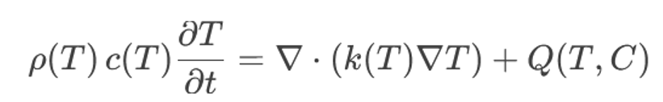
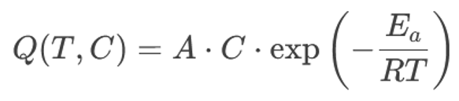
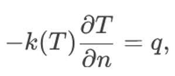
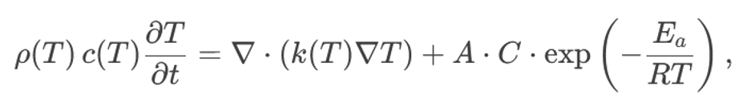
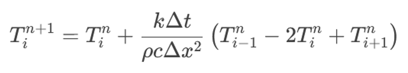
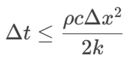
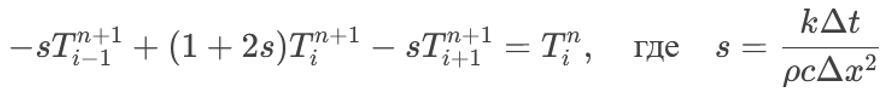
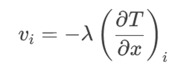
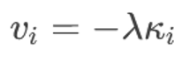

---
## Front matter
title: "Теплопроводность, детерминированное горение"
subtitle: "Этап №2"
author: | 
 | Замбалова Дина Владимировна
 | Кузнецова София Вадимовна
 | Поляков Глеб Сергеевич
 | Скандарова Полина Юрьевна
 | Цвелёв Сергей Андреевич
 | Шулуужук Айраана Вячеславовна

## Generic otions
lang: ru-RU
toc-title: "Содержание"

## Bibliography
bibliography: bib/cite.bib
csl: pandoc/csl/gost-r-7-0-5-2008-numeric.csl

## Pdf output format
toc: true # Table of contents
toc-depth: 2
lof: true # List of figures
lot: false # List of tables
fontsize: 12pt
linestretch: 1.5
papersize: a4
documentclass: scrreprt
## I18n polyglossia
polyglossia-lang:
  name: russian
  options:
	- spelling=modern
	- babelshorthands=true
polyglossia-otherlangs:
  name: english
## I18n babel
babel-lang: russian
babel-otherlangs: english
## Fonts
mainfont: PT Serif
romanfont: PT Serif
sansfont: PT Sans
monofont: PT Mono
mainfontoptions: Ligatures=TeX
romanfontoptions: Ligatures=TeX
sansfontoptions: Ligatures=TeX,Scale=MatchLowercase
monofontoptions: Scale=MatchLowercase,Scale=0.9
## Biblatex
biblatex: true
biblio-style: "gost-numeric"
biblatexoptions:
  - parentracker=true
  - backend=biber
  - hyperref=auto
  - language=auto
  - autolang=other*
  - citestyle=gost-numeric
## Pandoc-crossref LaTeX customization
figureTitle: "Рис."
tableTitle: "Таблица"
listingTitle: "Листинг"
lotTitle: "Список таблиц"
lolTitle: "Листинги"
## Misc options
indent: true
header-includes:
  - \usepackage{indentfirst}
  - \usepackage{float} # keep figures where there are in the text
  - \floatplacement{figure}{H} # keep figures where there are in the text
---

# Цель работы

Проанализировать и сравнить численные алгоритмы, применяемые для моделирования теплопроводности при детерминированном горении, с целью оценки их эффективности, устойчивости и точности при решении задач с высокой нелинейностью и резкими градиентами температуры.

# Задание

1. Охарактеризовать математическую модель теплопроводности с источником тепла, описывающую процессы при детерминированном горении.

2. Определить ключевые трудности численного моделирования (нелинейность, температурная зависимость коэффициентов, необходимость высокой точности в зоне фронта горения).

3. Рассмотреть три основных алгоритма численного решения: метод конечных разностей, метод конечных элементов, метод подвижных сеток.

4. Проанализировать особенности реализации каждого алгоритма, включая требования к сетке, аппроксимацию производных, устойчивость и сходимость.

5. Сравнить алгоритмы по ряду критериев: точность, вычислительная эффективность, адаптивность, пригодность к сложным геометриям и нелинейным эффектам.

6. Выявить области применимости каждого подхода и дать рекомендации по выбору алгоритма в зависимости от типа задачи.

# Выполнение лабораторной работы

Тема математического моделирования теплопроводности при детерминированном горении имеет огромное значение для множества областей, включая энергетику, проектирование систем пожарной безопасности, разработку новых огнеупорных материалов, моделирование химических реакторов и даже прогнозирование распространения лесных пожаров.
Детерминированное горение, в отличие от турбулентного, характеризуется тем, что процесс горения в значительной степени определяется известными физическими законами, начальными и граничными условиями. Это позволяет нам использовать математические модели для детального прогнозирования поведения системы и оптимизации процесса.

В нашем докладе мы сфокусируемся на алгоритмах численного решения уравнения теплопроводности с источником тепла, которое описывает распространение тепла и химические реакции в процессе горения. Мы рассмотрим три основных, хорошо зарекомендовавших себя подхода: метод конечных разностей, метод конечных элементов и метод подвижных сеток. Каждый из этих методов обладает своими уникальными преимуществами и ограничениями, которые мы постараемся подробно осветить. Наша главная цель – предоставить вам всесторонний обзор ключевых алгоритмов и их особенностей, чтобы вы могли оценить их применимость к вашим конкретным задачам и сделать осознанный выбор инструмента для моделирования.

Однако, прежде чем мы перейдем к обсуждению алгоритмов, важно отметить основные трудности, возникающие при моделировании горения. Это, прежде всего, высокая нелинейность задачи, связанная с температурной зависимостью параметров и источником тепла, а также необходимость точного разрешения узкой зоны реакции – фронта горения. Решение этих проблем требует использования специальных численных методов и адаптивных стратегий.

## Уравнение теплопроводности с источником тепла, граничные условия

В основе нашего моделирования лежит уравнение теплопроводности с источником тепла. В общем виде оно выглядит так:

{width=70%}

где:

- $ρ(T)$ - плотность материала, зависящая от температуры
- $c(T)$ - удельная теплоемкость, зависящая от температуры
- $T$ - температура
- $t$ - время
- $k(T)$ - коэффициент теплопроводности, зависящий от температуры
- $Q(T, C)$ - источник тепла, моделирующий процесс горения, зависящий от температуры и концентрации реагентов (C). Часто представляется в виде аррениусовской зависимости: 

{width=70%}

где $A$ - предэкспоненциальный фактор, $Ea$ - энергия активации, $R$ - универсальная газовая постоянная.

Важно подчеркнуть, что зависимость параметров от температуры – это ключевой фактор, определяющий нелинейность задачи. Например, коэффициент теплопроводности может меняться на порядки величины в диапазоне температур, характерных для процесса горения.

Для корректного решения уравнения теплопроводности необходимо задать граничные условия, описывающие взаимодействие системы с окружающей средой. Наиболее распространенные типы граничных условий:

Дирихле (1-го рода): заданная температура на границе: $T = T_{\text{границы}}$. Пример: поддержание постоянной температуры на поверхности.

Неймана (2-го рода): заданный тепловой поток на границе: 

{width=30%}

где $n$ - нормаль к поверхности, $q$ - плотность теплового потока. Пример: теплоизолированная граница $(q=0)$.

Робена (3-го рода): смешанное условие, связывающее температуру и тепловой поток:

{width=70%}

где $h$ - коэффициент теплоотдачи. Пример: конвективный теплообмен с окружающей средой.

Иногда, особенно при высоких температурах, необходимо учитывать тепловое излучение с поверхности. В этом случае граничное условие Робена дополняется членом, описывающим излучение по закону Стефана-Больцмана.

Выбор соответствующих граничных условий критически важен для получения физически достоверных результатов моделирования.

## Метод конечных разностей (МКР)

Метод конечных разностей (МКР) – это классический и, пожалуй, самый интуитивно понятный способ численного решения дифференциальных уравнений. Основная идея МКР состоит в дискретизации пространственной и временной областей и замене производных в уравнении теплопроводности их разностными аппроксимациями.

Приведен пример дискретизации одномерной и двумерной областей. Температура вычисляется в дискретных точках (узлах сетки) в дискретные моменты времени. Для аппроксимации производных по времени обычно используются явная и неявная схемы.

Явная схема. Значение температуры в узле $i$ на новом временном слое $n+1$ вычисляется непосредственно на основе значений температуры в соседних узлах на предыдущем временном слое $n$. Для одномерного уравнения теплопроводности можно использовать следующую аппроксимацию:

{width=65%}

Явная схема проста в реализации, но имеет серьезное ограничение на величину шага по времени из-за условия устойчивости Куранта-Фридрихса-Леви (КФЛ). Критерий КФЛ для явной схемы звучит так: 

{width=25%}

Нарушение этого условия приводит к неустойчивости решения – появлению нефизических осцилляций и быстрому росту ошибки.

Неявная схема. Значение температуры на новом временном слое вычисляется путем решения системы линейных алгебраических уравнений. Например, для одномерного уравнения:

{width=85%}

Неявная схема безусловно устойчива, что позволяет использовать больший шаг по времени, но требует больших вычислительных затрат на каждом шаге для решения системы уравнений.

При решении нелинейных задач, таких как моделирование горения, даже неявные схемы могут потребовать итерационного решения на каждом временном шаге.

Выбор между явной и неявной схемой – это всегда компромисс между простотой реализации, устойчивостью и вычислительными затратами. Правильный выбор шага по времени и пространству критически важен для получения точного и устойчивого решения.

## Метод конечных элементов (МКЭ)

Метод конечных элементов (МКЭ) – это более мощный и универсальный метод численного решения дифференциальных уравнений, особенно эффективный для задач в областях сложной формы. В МКЭ расчетная область разбивается на совокупность конечных элементов (например, треугольники, четырехугольники, тетраэдры и т.д., как показано на слайде). Внутри каждого элемента решение (в нашем случае, температура) аппроксимируется полиномиальной функцией, называемой базисной функцией.
Ключевой особенностью МКЭ является использование вариационной формулировки исходного дифференциального уравнения. Вместо решения самого уравнения теплопроводности, мы ищем функцию, которая минимизирует некоторый функционал, связанный с этим уравнением. Этот функционал представляет собой интеграл по области, содержащий производные от температуры.

Затем, используя базисные функции, мы аппроксимируем решение внутри каждого элемента и подставляем эту аппроксимацию в вариационную формулировку. После интегрирования по элементам и применения теоремы Грина, мы получаем систему линейных алгебраических уравнений относительно значений температуры в узлах конечных элементов. Эта система уравнений записывается в матричном виде: KU = F, где K - матрица жесткости, U - вектор узловых значений температуры, F - вектор нагрузки.

Матрица K формируется путем поэлементной сборки. Это означает, что вклад каждого элемента в общую матрицу суммируется. Сборка матрицы – один из самых ресурсоемких этапов в МКЭ.

МКЭ позволяет использовать различные типы конечных элементов и порядки аппроксимации. Например, можно использовать линейные, квадратичные или кубические базисные функции. Чем выше порядок аппроксимации, тем выше точность решения, но тем больше вычислительные затраты. Выбор типа элемента и порядка аппроксимации зависит от требуемой точности и сложности задачи.

При моделировании горения, где параметры могут сильно зависеть от температуры, необходимо использовать итерационные методы решения нелинейных систем уравнений, такие как метод Ньютона-Рафсона.

## Метод подвижных сеток (МПС)

При моделировании горения часто возникает узкая зона реакции – фронт горения. Для точного разрешения этой зоны необходимо значительное сгущение сетки вблизи фронта. Использование равномерной сетки с высоким разрешением по всей области расчета неэффективно и требует огромных вычислительных ресурсов. Метод подвижных сеток (МПС) позволяет адаптировать сетку к фронту горения, перемещая узлы сетки таким образом, чтобы они концентрировались в областях с высокими градиентами температуры или концентрации.

Ключевым элементом МПС является уравнение для скорости узлов сетки. Существует множество подходов к определению этого уравнения. Вот несколько примеров:

На основе градиента температуры: 

{width=30%}

где $i$ - скорость $i$-го узла сетки, $λ$ - коэффициент адаптации, определяющий интенсивность перемещения сетки, $(∂T/∂x)_i$ - градиент температуры в $i$-м узле сетки. Этот подход прост в реализации, но может приводить к чрезмерному сгущению узлов в областях с небольшими, но все же существенными градиентами.

На основе кривизны:  

{width=30%}

где $κ_i$ - кривизна изолинии температуры в $i$-м узле сетки. Этот подход позволяет сгущать узлы вблизи фронта горения, даже если градиент температуры относительно невелик.

На основе ошибки решения: Скорость узлов определяется таким образом, чтобы минимизировать оценку ошибки численного решения.Этот подход является наиболее сложным в реализации, но может обеспечить оптимальное распределение узлов сетки.

Алгоритм перемещения сетки обычно включает несколько этапов:
Вычисление скорости узлов сетки на основе выбранного критерия.
Перемещение узлов сетки на небольшое расстояние в соответствии с вычисленной скоростью.
Проверка качества сетки (например, минимальный угол элемента). Если качество сетки ухудшилось (например, элементы стали слишком вытянутыми), выполняется процедура решеинга – перестроения сетки.

Решение – это важный этап в МПС, который позволяет поддерживать качество сетки и предотвращать возникновение численных ошибок. Решеинг может быть локальным (перестраиваются только отдельные элементы) или глобальным (перестраивается вся сетка).

Использование МПС позволяет значительно повысить точность решения вблизи фронта горения, сохраняя при этом умеренное количество узлов сетки. Однако МПС требует более сложной реализации и тщательной настройки параметров адаптации и решеинга.”

# Выводы

В заключение, мы рассмотрели три основных алгоритма численного решения задачи теплопроводности при детерминированном горении: метод конечных разностей, метод конечных элементов и метод подвижных сеток.

| Критерий                 | МКР          | МКЭ            | МПС               |
|--------------------------|--------------|----------------|-------------------|
| Простота реализации      | Высокая      | Средняя        | Низкая            |
| Точность                 | Средняя      | Высокая        | Очень высокая (вблизи фронта)     |
| Вычислительные затраты   | Низкие       | Средние        | Высокие (особеннопри адаптации сетки)           |
| Сложная геометрия        | Ограничена   | Подходит       | Подходит          |
| Адаптация к фронту       | Нет          | Нет            | Да                |
| Устойчивость             | Зависит от схемы (явная/неявная) | Обычно высокая (неявные схемы) | Требует особого внимания |

Здесь представлена сравнительная таблица рассмотренных алгоритмов по ключевым критериям. Как видите, каждый метод имеет свои сильные и слабые стороны. Выбор конкретного алгоритма зависит от специфики задачи, требуемой точности и доступных вычислительных ресурсов. Например, для простых задач с небольшими требованиями к точности подойдет МКР. Для задач со сложной геометрией и высокими требованиями к точности лучше использовать МКЭ. А для задач, где важна высокая точность вблизи фронта горения, оптимальным выбором будет МПС.

Эта таблица является отправной точкой для нашего дальнейшего выбора и комбинации алгоритмов.

# Источники

Медведев Д. А., Куперштох А. Л., Прууэл Э. Р., Сатонкина Н. П., Карпов Д. И. Моделирование физических процессов и явлений на ПК: Учеб. пособие / Новосибирск: Новосиб. гос. ун-т., 2010. — 101 с.
